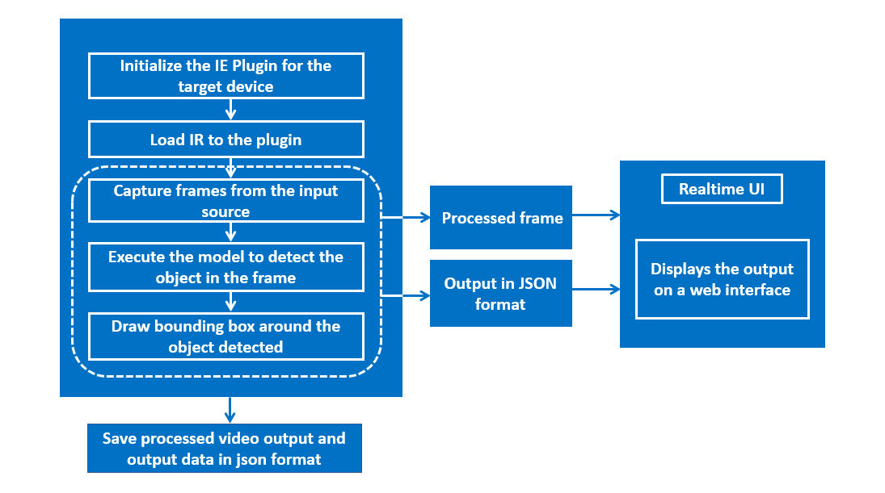
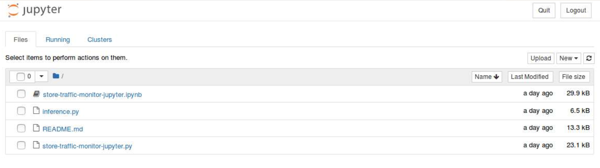
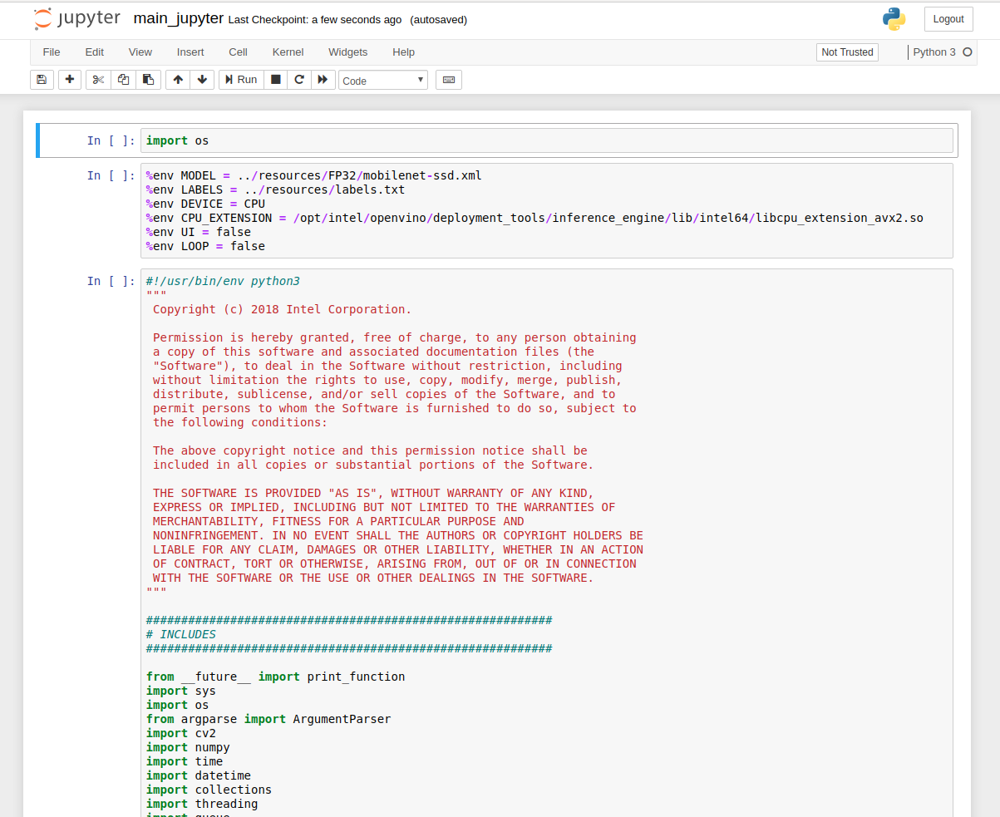

# Store Traffic Monitor

| Details           |              |
|-----------------------|---------------|
| Target OS:            |  Ubuntu\* 16.04 LTS   |
| Programming Language: |  Python* 3.5 |
| Time to Complete:    |  50-70min     |


An application capable of detecting objects on any number of screens.

## What it Does
This sample application detects objects in a video stream and calculates the average count of the object in the video stream. Potential use cases of this application are to monitor the activity of people inside and outside a facility, keeping tracking of product inventory etc.

## Requirements
### Hardware
* 6th to 8th Generation Intel® Core™ processor with Iris® Pro graphics or Intel® HD Graphics

### Software
* [Ubuntu\* 16.04 LTS](http://releases.ubuntu.com/16.04/)<br>
   *Note*: We recommend using a 4.14+ Linux* kernel with this software. Run the following command to determine your kernel version:

      uname -a
  
* OpenCL™ Runtime Package
* Intel® Distribution of OpenVINO™ toolkit 2019 R2 Release
* Jupyter* Notebook v5.7.0

## How it Works
The counter uses the Inference Engine included in the Intel® Distribution of OpenVINO™ toolkit. A trained neural network detects objects within a designated area by displaying a green bounding box over them. This reference implementation identifies multiple objects entering the frame and identifies their class, count, and time entered. 



## Setup

### Get the code

Steps to clone the reference implementation: (store-traffic-monitor)
```
sudo apt-get update && sudo apt-get install git 
git clone https://github.com/intel-iot-devkit/store-traffic-monitor-python.git
``` 

### Install the Intel® Distribution of OpenVINO™ toolkit
Refer to [Install Intel® Distribution of OpenVINO™ toolkit for Linux*](https://software.intel.com/en-us/articles/OpenVINO-Install-Linux) on how to install and setup the Intel® Distribution of OpenVINO™ toolkit.

You will need the OpenCL™ Runtime Package if you plan to run inference on the GPU. It is not mandatory for CPU inference.

### Other dependencies
#### FFmpeg* 
FFmpeg is a free and open-source project capable of recording, converting and streaming digital audio and video in various formats. It can be used to do most of our multimedia tasks quickly and easily say, audio compression, audio/video format conversion, extract images from a video and a lot more.


### Which model to use
This application uses the [mobilenet-ssd](https://github.com/chuanqi305/MobileNet-SSD) model, that can be accessed using the **model downloader**. The **model downloader** downloads the model as Caffe* model files. These need to be passed through the **model optimizer** to generate the IR (the __.xml__ and __.bin__ files) that will be used by the application.

The application also works with any object-detection model, provided it has the same input and output format of the SSD model.
The model can be any object detection model:
- Downloaded using the **model downloader**, provided by Intel® Distribution of OpenVINO™ toolkit.

- Built by the user.<br>

To install the dependencies of the RI and to download the **mobilenet-ssd** Intel® model, run the following command:

    cd <path_to_the_store-traffic-monitor-python_directory>
    ./setup.sh 

### The labels file
This application requires a _labels_ file associated with the model being used for detection. All detection models work with integer labels and not string labels (e.g. for the ssd300 and mobilenet-ssd models, the number 15 represents the class "person"), that is why each model must have a _labels_ file, which associates an integer (the label the algorithm detects) with a string (denoting the human-readable label).   

The _labels_ file is a text file containing all the classes/labels that the model can recognize, in the order that it was trained to recognize them (one class per line).<br> 

For mobilenet-ssd model, _labels.txt_ file is provided in the _resources_ directory.
    
### The Config file
The **resources/config.json** contains the videos that will be used by the application.   

The _config.json_ file is of the form name/value pair, `"video": <path/to/video>` and `"label": <label>`   
For example:
```
{
    
    "inputs": [

	    {
            "video": "videos/video1.mp4",
            "label": "person"
        }
    ]
    
}
```

The `path/to/video` is the path, on the local system, to a video to use as input and the `label` is of the class (person, bottle, etc.) to be detected on that video. The labels used in the _config.json_ file must be present in the labels from the _labels.txt_ file.

The application can use any number of videos for detection (i.e. the _config.json_ file can have any number of item), but the more videos the application uses in parallel, the more the frame rate of each video scales down. This can be solved by adding more computation power to the machine on which the application is running.

### Which Input video to use
The application works with any input video. Sample videos for object detection are provided [here](https://github.com/intel-iot-devkit/sample-videos/). <br>

For first-use, we recommend using the [people-detection](https://github.com/intel-iot-devkit/sample-videos/blob/master/people-detection.mp4), [one-by-one-person-detection](https://github.com/intel-iot-devkit/sample-videos/blob/master/one-by-one-person-detection.mp4), [bottle-detection](https://github.com/intel-iot-devkit/sample-videos/blob/master/bottle-detection.mp4) videos. The videos are automatically downloaded to the `resources/` folder by setup.sh. For example:<br>

The config.json would be:

```
{
    
    "inputs": [

	    {
            "video": "sample-videos/people-detection.mp4",
            "label": "person"
        },
        {
            "video": "sample-videos/one-by-one-person-detection.mp4",
            "label": "person"
        },
        {
            "video": "sample-videos/bottle-detection.mp4",
            "label": "bottle"
        }
    ]
    
}
```
 
If the user wants to use any other video, specify the video path in config.json file

### Using the Camera instead of video
Replace `path/to/video` with the camera ID in config.json and the label to be found, where the ID is taken from the video device (the number X in /dev/videoX).
On Ubuntu, to list all available video devices use the following command:

    ls /dev/video*

For example, if the output of above command is `/dev/video0`, then config.json would be:

```
{
    
    "inputs": [

	    {
            "video": "0",
            "label": "person"
        }
    ]
    
}
```

## Setup the environment
You must configure the environment to use the Intel® Distribution of OpenVINO™ toolkit one time per session by running the following command:

    source /opt/intel/openvino/bin/setupvars.sh -pyver 3.5
    
__Note__: This command needs to be executed only once in the terminal where the application will be executed. If the terminal is closed, the command needs to be executed again.

## Run the Application on Jupyter*

<!--
**Note:**<br>
Before running the application on the FPGA, program the AOCX (bitstream) file. Use the setup_env.sh script from [fpga_support_files.tgz](http://registrationcenter-download.intel.com/akdlm/irc_nas/12954/fpga_support_files.tgz) to set the environment variables.<br>
For example:

    source /home/<user>/Downloads/fpga_support_files/setup_env.sh
    
The bitstreams for HDDL-F can be found under the `/opt/intel/openvino/bitstreams/a10_vision_design_bitstreams` folder.<br>To program the bitstream use the below command:<br>
    
    aocl program acl0 /opt/intel/openvino/bitstreams/a10_vision_design_bitstreams/2019R1_PL1_FP11_MobileNet_Clamp.aocx
    
For more information on programming the bitstreams, please refer to https://software.intel.com/en-us/articles/OpenVINO-Install-Linux-FPGA#inpage-nav-11 <br>
<br>
-->
Go to the _store-traffic-monitor-python directory_ and open the Jupyter notebook by running the following commands:

    cd <path_to_the_store-traffic-monitor-python_directory>/Jupyter
 
    jupyter notebook


#### Follow the steps to run the code on Jupyter*:



1. Click on **New** button on the right side of the Jupyter window.

2. Click on **Python 3** option from the drop down list.

3. In the first cell type **import os** and press **Shift+Enter** from the keyboard.

4. Export the below environment variables in second cell of Jupyter and press **Shift+Enter**.<br>
   
       %env MODEL = ../resources/FP32/mobilenet-ssd.xml
       %env LABELS = ../resources/labels.txt
       %env DEVICE = CPU
       %env CPU_EXTENSION = /opt/intel/openvino/deployment_tools/inference_engine/lib/intel64/libcpu_extension_avx2.so
       %env UI = false
       %env LOOP = false

 To run the application on sync mode, export the environment variable **%env FLAG = sync**. By default, the application runs on async mode.
   
5. Copy the code from **store-traffic-monitor-jupyter.py** and paste it in the next cell and press **Shift+Enter**.

6. Alternatively, code can be run in the following way.

    i. Click on the **store-traffic-monitor-jupyter.ipynb** file in the Jupyter notebook window.
    
    ii. Click on the **Kernel** menu and then select **Restart & Run All** from the drop down list.
    
    iii. Click on Restart and Run All Cells.

    

**NOTE:**

1. To run the application on **GPU**:
     * With the floating point precision 32 (FP32), change the **%env DEVICE = CPU** to **%env DEVICE = GPU**<br>
     **FP32**: FP32 is single-precision floating-point arithmetic uses 32 bits to represent numbers. 8 bits for the magnitude and 23 bits for the precision. For more information, [click here](https://en.wikipedia.org/wiki/Single-precision_floating-point_format)<br>

     * With the floating point precision 16 (FP16), 
       
       * change the **%env DEVICE = CPU** to **%env DEVICE = GPU**
       * Please follow steps from **Downloading the mobilenet-ssd Intel® Model** section to download FP16 model. Set the path of the FP16 model in the environment variable `MODEL` as given below: <br>
       **%env MODEL = ../resources/FP16/mobilenet-ssd.xml** <br>
       
       **FP16**: FP16 is half-precision floating-point arithmetic uses 16 bits. 5 bits for the magnitude and 10 bits for the precision. For more information, [click here](https://en.wikipedia.org/wiki/Half-precision_floating-point_format)

     * **CPU_EXTENSION** environment variable is not required.
   
2. To run the application on **Intel® Neural Compute Stick**: 
      * Change the **%env DEVICE = CPU** to **%env DEVICE = MYRIAD**.  
      * The Intel® Neural Compute Stick can only run FP16 models. Please follow steps from **Downloading the mobilenet-ssd Intel® Model** section to download FP16 model. Set the path of the FP16 model in the environment variable `MODEL` as given below: <br>
       **%env MODEL = ../resources/FP16/mobilenet-ssd.xml** <br>        
      * **CPU_EXTENSION** environment variable is not required.

3. To run the application on **Intel® Movidius™ VPU**:
      * Change the **%env DEVICE = CPU** to **%env DEVICE = HDDL**
      * The Intel® Movidius™ VPU can only run FP16 models. Change the environment variable for the model as shown below  and the model that is passed to the application must be of data type FP16. <br>
      **%env MODEL = ../resources/FP16/mobilenet-ssd.xml** <br>
      * **CPU_EXTENSION** environment variable is not required.

4.  By default, the application reads the input videos only once. To continuously loop the videos, change the value of LOOP in the environmental variable as given below.

    Change the **%env LOOP = false** to **%env LOOP = true**

5. To run the application on multiple devices: <br>
   For example:
      * Change the **%env DEVICE = CPU** to **%env DEVICE = MULTI:CPU,GPU,MYRIAD**
      * With the **floating point precision 16 (FP16)**, change the path of the model in the environment variable **MODEL** as given below: <br>
      **%env MODEL = ../resources/FP16/mobilenet-ssd.xml** <br>
      * **%env CPU_EXTENSION=/opt/intel/openvino/deployment_tools/inference_engine/lib/intel64/libcpu_extension_avx2.so**<br>

<!--
6. To run the application on **FPGA**:
      * Change the **%env DEVICE = CPU** to **%env DEVICE = HETERO:FPGA,CPU**
      * With the **floating point precision 16 (FP16)**, change the path of the model in the environment variable **MODEL** as given below: <br>
      **%env MODEL = ../resources/FP16/mobilenet-ssd.xml** <br>
      * **%env CPU_EXTENSION=/opt/intel/openvino/deployment_tools/inference_engine/lib/intel64/libcpu_extension_avx2.so**<br>
-->

#### Using the browser UI

The default application uses a simple user interface created with OpenCV. A web based UI, with more features is also provided with this application.<br>
To run the application with UI mode on, change the environment variable `UI` in second cell to `true` i.e <br>
```%env UI = true```<br>

Follow the readme provided [here](../UI) to run the web based UI.
