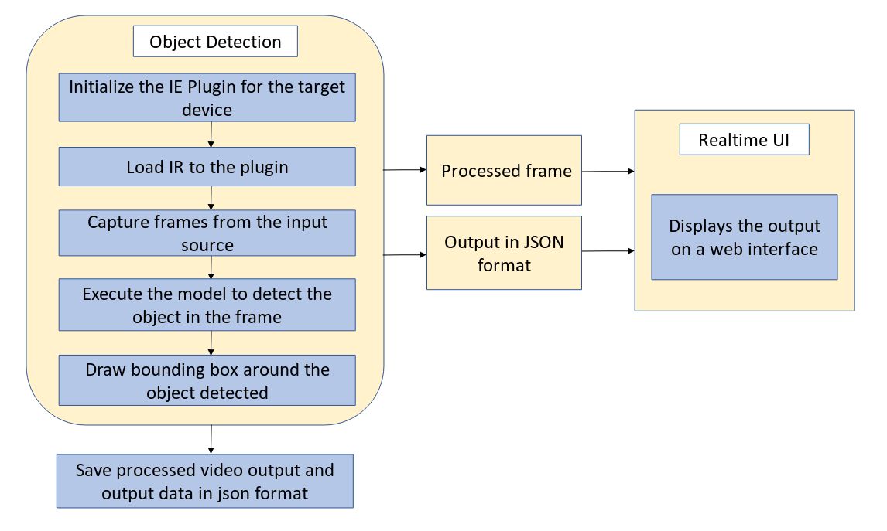
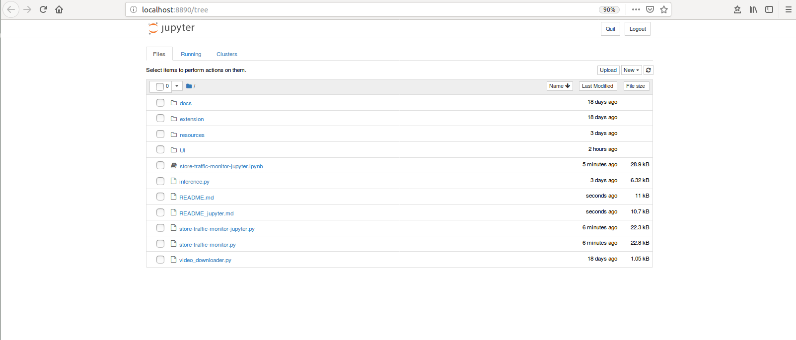

# Store Traffic Monitor

| Details           |              |
|-----------------------|---------------|
| Target OS:            |  Ubuntu\* 16.04 LTS   |
| Programming Language: |  Python* 3.5 |
| Time to Complete:    |  50-70min     |


An application capable of detecting objects on any number of screens.

## What it Does
This application is one of a series of IoT reference implementations aimed at instructing users on how to develop a working solution for a particular problem. It demonstrates how to create a smart video IoT solution using Intel® hardware and software tools. This reference implementation monitors people activity inside and outside a facility, as well as counting product inventory.

## How it Works
The counter uses the Inference Engine included in the Intel® Distribution of OpenVINO™ toolkit. A trained neural network detects objects within a designated area by displaying a green bounding box over them. This reference implementation identifies multiple objects entering the frame and identifies their class, count, and time entered. 


## Requirements
### Hardware
* 6th to 8th Generation Intel® Core™ processor with Iris® Pro graphics or Intel® HD Graphics

### Software
* [Ubuntu\* 16.04 LTS](http://releases.ubuntu.com/16.04/)<br>
   *Note*: We recommend using a 4.14+ Linux* kernel with this software. Run the following command to determine your kernel version:

      uname -a
  
* OpenCL™ Runtime Package
* Intel® Distribution of OpenVINO™ toolkit 2019 R1 Release

## Setup

### Install the Intel® Distribution of OpenVINO™ toolkit
Refer to https://software.intel.com/en-us/articles/OpenVINO-Install-Linux on how to install and setup the Intel® Distribution of OpenVINO™ toolkit.

You will need the OpenCL™ Runtime Package if you plan to run inference on the GPU. It is not mandatory for CPU inference.

### FFmpeg
FFmpeg is installed separately from the Ubuntu repositories:

    sudo apt update
    sudo apt install ffmpeg

### Install Python* Dependencies

    sudo apt-get update
    sudo apt-get install python3-pip python3-numpy

Install Jupyter* using the command:

    pip3 install jupyter

## Configure the application

### What model to use
The application works with any object-detection model, provided it has the same input and output format of the SSD model.  
The model can be any object detection model:

* Downloaded using the **model downloader**, provided by the Intel® Distribution of OpenVINO™ toolkit.
* Built by the user.
   
By default, this application uses the mobilenet-ssd model, that can be accessed using the **model downloader**.
The **model downloader** downloads the model as Caffe* model files. These need to be passed through the **model optimizer** to generate the IR (the __.xml__ and __.bin__ files), that will be used by the application.
   
   
#### Download the mobilenet-ssd Intel® Model
* Go to the model downloader directory present inside Intel® Distribution of OpenVINO™ toolkit:

      cd /opt/intel/openvino/deployment_tools/tools/model_downloader/

* Specify which model to download with --name and the output path with -o, otherwise it will be downloaded to the current folder. Run the model downloader with the following command:

      sudo ./downloader.py --name mobilenet-ssd
  
* The model will be downloaded inside the `object_detection/common` directory. To make it work with the Intel® Distribution of OpenVINO™ toolkit, the model needs to be passed through the model optimizer to generate the IR (the .xml and .bin files). 

  **Note:** If you haven't configured the **model optimizer** yet, follow the instructions provided [here](https://software.intel.com/en-us/articles/OpenVINO-ModelOptimizer).<br>

* After configuring the model optimizer, go to the model optimizer directory:   

      cd /opt/intel/openvino/deployment_tools/model_optimizer/
   
* Assuming you've downloaded the reference-implementation to your home directory, run this command to optimize mobilenet-ssd:

      ./mo_caffe.py --input_model /opt/intel/openvino/deployment_tools/tools/model_downloader/object_detection/common/mobilenet-ssd/caffe/mobilenet-ssd.caffemodel  -o $HOME/store-traffic-monitor-python/resources/FP32 --data_type FP32 --scale 256 --mean_values [127,127,127]

  **Note:** Replace $HOME in the above command with the path to the _store-traffic-monitor-python_ directory.

* To optimize the model for FP16:

      ./mo_caffe.py --input_model /opt/intel/openvino/deployment_tools/tools/model_downloader/object_detection/common/mobilenet-ssd/caffe/mobilenet-ssd.caffemodel  -o $HOME/store-traffic-monitor-python/resources/FP16 --data_type FP16 --scale 256 --mean_values [127,127,127]

### The labels file
This application requires a _labels_ file associated with the model being used for detection. All detection models work with integer labels and not string labels (e.g. for the ssd300 and mobilenet-ssd models, the number 15 represents the class "person"), that is why each model must have a _labels_ file, which associates an integer (the label the algorithm detects) with a string (denoting the human-readable label).   
The _labels_ file is a text file containing all the classes/labels that the model can recognize, in the order that it was trained to recognize them (one class per line).<br> 
For mobilenet-ssd model, _labels.txt_ file is provided in the _resources_ directory.


### The config file
The **resources/conf.txt** contains the videos that will be used by the application, one video per line.   
Each of the lines in the file is of the form `path/to/video label`. For example:

    videos/video1.mp4 person

The `path/to/video` is the path, on the local system, to a video to use as input. Followed by the one `label` of the class (person, bottle, etc.) to be detected on that video. The labels used in the _conf.txt_ file must be present in the labels from the _labels_ file.

The application can use any number of videos for detection (i.e. the _conf.txt_ file can have any number of lines), but the more videos the application uses in parallel, the more the frame rate of each video scales down. This can be solved by adding more computation power to the machine on which the application is running.


### Use an Input Video File
The application works with any input video. Sample videos for object detection are provided [here](https://github.com/intel-iot-devkit/sample-videos/). <br>

For first-use, we recommend using the [people-detection](https://github.com/intel-iot-devkit/sample-videos/blob/master/people-detection.mp4), [one-by-one-person-detection](https://github.com/intel-iot-devkit/sample-videos/blob/master/one-by-one-person-detection.mp4), [bottle-detection](https://github.com/intel-iot-devkit/sample-videos/blob/master/bottle-detection.mp4) videos. For example:

    sample-videos/people-detection.mp4 person
    sample-videos/one-by-one-person-detection.mp4 person
    sample-videos/bottle-detection.mp4 bottle

These videos can be downloaded directly, via the `video_downloader` python script provided. <br>
Go to _store-traffic-monitor-python_ directory and run the following command:

    python3 video_downloader.py

The videos are automatically downloaded to the `resources/` folder.

### Using camera stream instead of video file
Replace `path/to/video` with the camera ID in conf.txt and the label to be found, where the ID is taken from the video device (the number X in /dev/videoX).
On Ubuntu, to list all available video devices use the following command:

    ls /dev/video*

For example, if the output of above command is `/dev/video0`, then conf.txt would be:

    0 person


## Setup the environment
You must configure the environment to use the Intel® Distribution of OpenVINO™ toolkit one time per session by running the following command:
 
    source /opt/intel/openvino/bin/setupvars.sh -pyver 3.5

## Run the code on Jupyter*

**Note:**<br>
Before running the application on the FPGA, program the AOCX (bitstream) file. Use the setup_env.sh script from [fpga_support_files.tgz](http://registrationcenter-download.intel.com/akdlm/irc_nas/12954/fpga_support_files.tgz) to set the environment variables.<br>
For example:

    source /home/<user>/Downloads/fpga_support_files/setup_env.sh
    
The bitstreams for HDDL-F can be found under the `/opt/intel/openvino/bitstreams/a10_vision_design_bitstreams` folder.<br>To program the bitstream use the below command:<br>
    
    aocl program acl0 /opt/intel/openvino/bitstreams/a10_vision_design_bitstreams/2019R1_PL1_FP11_MobileNet_Clamp.aocx
    
For more information on programming the bitstreams, please refer to https://software.intel.com/en-us/articles/OpenVINO-Install-Linux-FPGA#inpage-nav-11 <br>
<br>

Go to the _store-traffic-monitor-python directory_ and open the Jupyter notebook by running the following commands:

    cd <path_to_the_store-traffic-monitor-python_directory>
 
    jupyter notebook


#### Follow the steps to run the code on Jupyter*:



1. Click on **New** button on the right side of the Jupyter window.

2. Click on **Python 3** option from the drop down list.

3. In the first cell type **import os** and press **Shift+Enter** from the keyboard.

4. Export the below environment variables in second cell of Jupyter and press **Shift+Enter**.<br>
   
       %env MODEL = resources/FP32/mobilenet-ssd.xml
       %env LABELS = resources/labels.txt
       %env DEVICE = CPU
       %env CPU_EXTENSION = /opt/intel/openvino/deployment_tools/inference_engine/lib/intel64/libcpu_extension_avx2.so
       %env UI = false
       %env LOOP = false
    
5. Copy the code from **store-traffic-monitor-jupyter.py** and paste it in the next cell and press **Shift+Enter**.

6. Alternatively, code can be run in the following way.

    i. Click on the **store-traffic-monitor-jupyter.ipynb** file in the Jupyter notebook window.
    
    ii. Click on the **Kernel** menu and then select **Restart & Run All** from the drop down list.
    
    iii. Click on Restart and Run All Cells.

    

**NOTE:**

1. To run the application on **GPU**:
     * With the floating point precision 32 (FP32), change the **%env DEVICE = CPU** to **%env DEVICE = GPU**
     * With the floating point precision 16 (FP16), 
       
       * change the **%env DEVICE = CPU** to **%env DEVICE = GPU**
       * Please follow steps from **Downloading the mobilenet-ssd Intel® Model** section to download FP16 model. Set the path of the FP16 model in the environment variable `MODEL` as given below: <br>
       **%env MODEL = resources/FP16/mobilenet-ssd.xml** <br>
     * **CPU_EXTENSION** environment variable is not required.
   
2. To run the application on **Intel® Neural Compute Stick**: 
      * Change the **%env DEVICE = CPU** to **%env DEVICE = MYRIAD**.  
      * The Intel® Neural Compute Stick can only run FP16 models. Please follow steps from **Downloading the mobilenet-ssd Intel® Model** section to download FP16 model. Set the path of the FP16 model in the environment variable `MODEL` as given below: <br>
       **%env MODEL = resources/FP16/mobilenet-ssd.xml** <br>        
      * **CPU_EXTENSION** environment variable is not required.

3. To run the application on **HDDL**:
      * Change the **%env DEVICE = CPU** to **%env DEVICE = HETERO:HDDL,CPU**
      * The HDDL-R can only run FP16 models. Change the environment variable for the model as shown below  and the model that is passed to the application must be of data type FP16. <br>
      **%env MODEL = resources/FP16/mobilenet-ssd.xml** <br>
      * **%env CPU_EXTENSION=/opt/intel/openvino/deployment_tools/inference_engine/lib/intel64/libcpu_extension_avx2.so**<br>

4. To run the application on **FPGA**:
      * Change the **%env DEVICE = CPU** to **%env DEVICE = HETERO:FPGA,CPU**
      * With the **floating point precision 16 (FP16)**, change the path of the model in the environment variable **MODEL** as given below: <br>
      **%env MODEL = resources/FP16/mobilenet-ssd.xml** <br>
      * **%env CPU_EXTENSION=/opt/intel/openvino/deployment_tools/inference_engine/lib/intel64/libcpu_extension_avx2.so**<br>

5.  By default, the application reads the input videos only once. To continuously loop the videos, change the value of LOOP in the environmental variable as given below.

    Change the **%env LOOP = false** to **%env LOOP = true**

#### Using the browser UI

The default application uses a simple user interface created with OpenCV. A web based UI, with more features is also provided with this application.<br>
To run the application with UI mode on, change the environment variable `UI` in second cell to `true` i.e <br>
```%env UI = true```<br>

Follow the readme provided [here](./UI) to run the web based UI.
